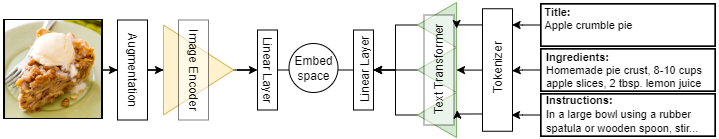
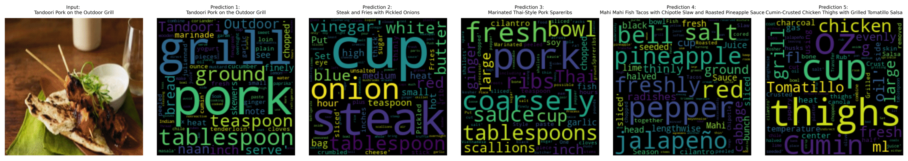
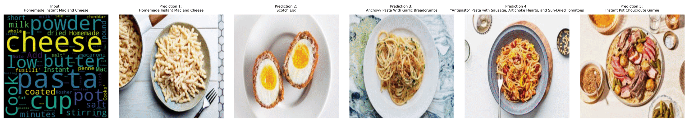

# Text and vision Transformers for image-to-recipe retrieval
Repository for image-to-recipe retrieval project for the DTU Course Advanced Deep Learning in Computer Vision (02501). You can find our poster [here](poster/poster_ADLCV.pdf)!

# Background
The goal of image-to-recipe retrieval is to retrieve a recipe (given a list of known recipes) given an image query through **self-supervised learning**. This is achieved by projecting the image and text recipes to high-dimensional embedding (vector) space using Transformer models. For any given image, the "correct" recipe can be retrieved by choosing the recipe vector with the lowest distance to the image vector. 

The image and text Transformers are trained simultaniously using the [Triplet loss](https://en.wikipedia.org/wiki/Triplet_loss) to embed images and texts into the same latent embedding space. The model is trained in a **self-supervised** manner, meaning no labels are given to the model. Instead, the model learns implicit labels via the Triplet loss function.


Learning a common embedding space means we can also perform opposite task: recipe-to-image retrieval.

# Getting started
Create an environment with ``Python 3.10`` and install the dependencies.
```
pip install -r requirements.txt
```

# Train and evaluate your own model
The Food Ingredients and Recipes data can be downloaded [here](https://www.kaggle.com/datasets/pes12017000148/food-ingredients-and-recipe-dataset-with-images). To train your model run the following:
```
python src/models/train_model.py --image_size 224 --model_name "models/best_model_ever_3.pt" --mode 3 --pretrained
```
The ``--mode`` flag controls the text modality. 1 is just the title, 2 is title+ingredients, and 3 is title+ingredients+instructions.


Get results by running `
```python src/models/predict_model.py```
Followed by
```python src/visualization/visualize.py```

# Results
Top 5 retrievals for image-to-text retrieval task


Top 5 retrievals for text-to-image retrieval task
